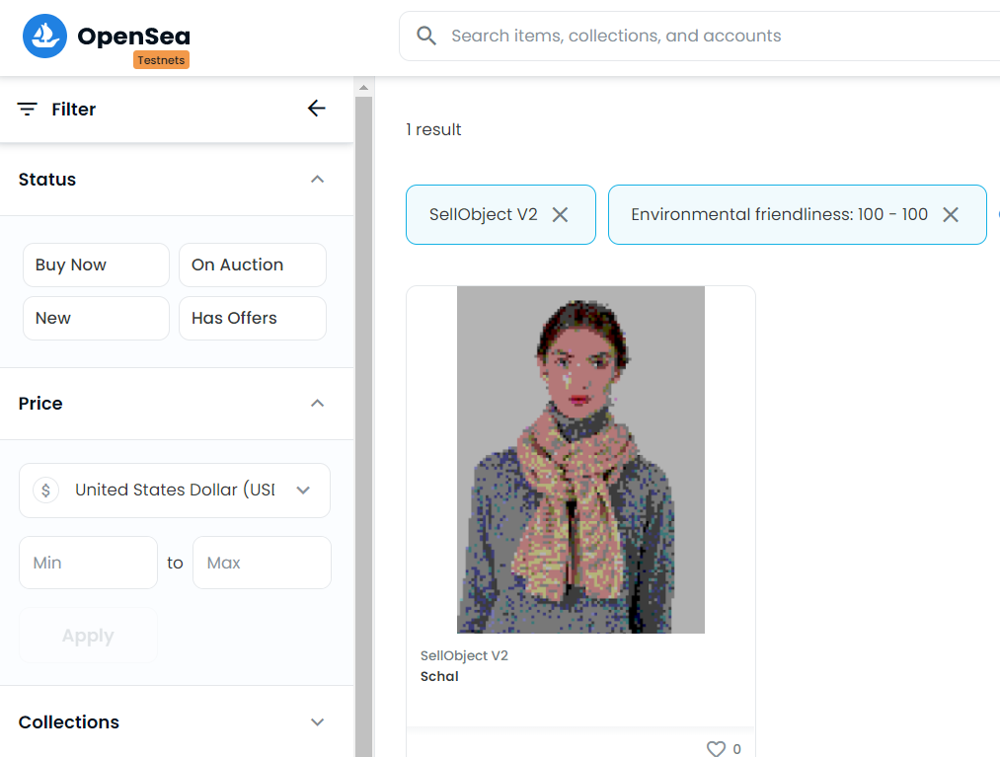

# Smart Contract to sell non-fungible tokens

As a starting point we use the tested openzeppelin ERC-721 contract with several extensions.

The smart contract *SellObject.sol* allows the owner to mint NFTs (representing real world objects), providing name, description and image.
The metadata and images are stored on IPFS.

## Setup

To run the deployment scripts, install [brownie](https://eth-brownie.readthedocs.io/en/stable/install.html).

To deploy contracts on live testnets, create an .env file with the enironmental variables shown in *.env_example*

The NFT metadata are stored on IPFS via [Pinata](https://www.pinata.cloud/). This requires to sign up for a (free) account and creating an API key.

## Todo

- Write tests for individual functions.
- Implement functions to sell NFTs with custom tokens.
  
When deploying the contract to the rinkeby testnet, NFTs will automatically appear on the [opensea](https://opensea.io/) platform for sale.
